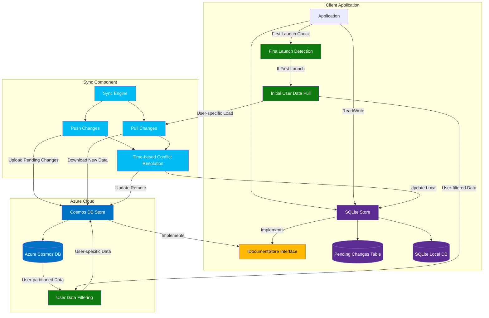
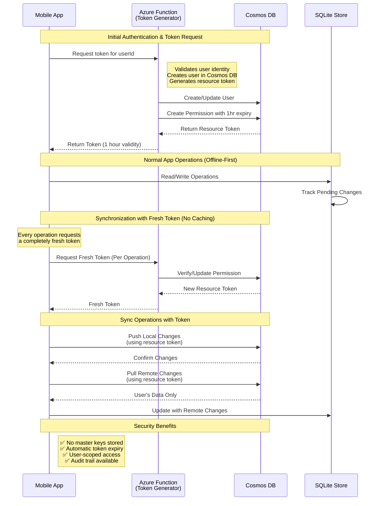
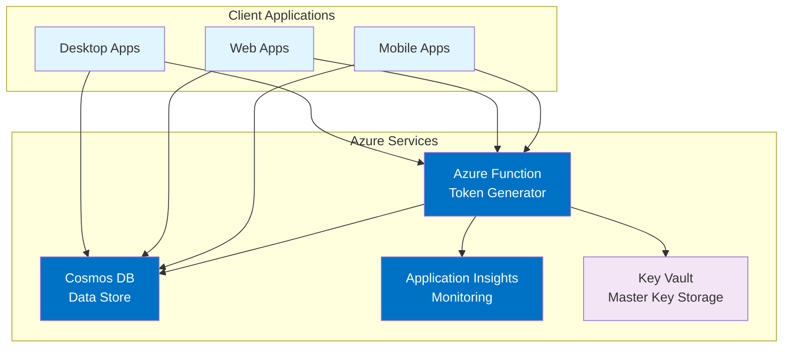

# Cosmos DB Offline Synchronization with Last-Write-Wins

This project demonstrates an offline-first synchronization solution between Azure Cosmos DB and SQLite using Last-Write-Wins conflict resolution strategy.

## Overview

This project demonstrates an offline-first synchronization solution between Azure Cosmos DB and SQLite using Last-Write-Wins conflict resolution strategy.

## Synchronization System

The synchronization system is the core component that enables offline-first functionality with bidirectional data sync between local SQLite and Azure Cosmos DB. It implements a Last-Write-Wins conflict resolution strategy and supports user-specific data filtering.

### Key Features

- **Offline-First Design**: Applications work seamlessly offline with automatic sync when connectivity returns
- **Last-Write-Wins Conflict Resolution**: Uses timestamps to automatically resolve conflicts
- **User-Specific Data**: Filters data by user ID for multi-tenant scenarios
- **Batch Operations**: Optimized for performance with bulk transfers
- **Automatic Change Tracking**: Local changes are automatically tracked for synchronization

### Architecture

The synchronization system consists of three main layers:

#### Client Application Layer

- Applications interact directly with the local SQLite store
- The SQLite store implements the `IDocumentStore` interface for consistent API
- All writes are tracked in "Pending Changes" tables
- Enables offline functionality with no Azure connectivity required

#### Synchronization Component

- **SyncEngine**: Core synchronization logic with bidirectional data flow
- **Push Module**: Sends local changes to Cosmos DB when online
- **Pull Module**: Retrieves changes from Cosmos DB to local storage
- **Conflict Resolution**: Uses timestamps to determine which version "wins"
- Follows Azure best practices for handling transient failures

#### Azure Cloud Layer

- **CosmosDbStore**: Implements the same `IDocumentStore` interface
- Creates consistent abstraction between local and cloud storage
- Leverages Cosmos DB's global distribution and high availability
- Supports user-specific data partitioning

### Synchronization Process

#### Before Synchronization

**Local Changes Tracking:**

- When users create, update, or modify data locally:
  - Documents are stored/updated in main tables (e.g., `Items`)
  - Entries are added to `PendingChanges_{ModelName}` tables
  - `LastModified` timestamps are updated to current time

**Data Access Pattern:**

- All application operations work against the local database
- Enables offline functionality regardless of network connectivity
- Users can continue working without interruption

#### During Synchronization

##### Phase 1: Push (Local to Remote)

1. **Pending Changes Collection**:
   - Query local SQLite for all items in `PendingChanges_{ModelName}` tables
   - Load corresponding full documents from main data tables
   - Create complete set of local changes for cloud push

2. **Batch Preparation**:
   - Collect document IDs in batches for efficient retrieval
   - Ensure all documents have proper User ID, Type, and Timestamp properties

3. **Remote Validation**:
   - Retrieve all relevant remote items in single batch operation
   - For each pending local change, compare with remote version:
     - If local timestamp > remote timestamp: Push local version
     - If remote timestamp > local timestamp: Skip (remote wins)
     - If item doesn't exist remotely: Always push

4. **Bulk Updates**:
   - Send documents requiring updates to Cosmos DB in bulk
   - Minimizes network requests and reduces RU consumption
   - Include proper partition key information

5. **Pending Status Clearing**:
   - Remove IDs from `PendingChanges_{ModelName}` tables after successful push
   - Occurs regardless of whether item was pushed or skipped

##### Phase 2: Pull (Remote to Local)

1. **Remote Data Retrieval**:
   - Retrieve all documents for current user from Cosmos DB
   - Use partition key query for efficiency, filtering by user ID

2. **Local Comparison**:
   - For each remote document, perform point lookup in local database
   - Compare timestamps to determine which version is newer

3. **Timestamp-Based Updates**:
   - If remote timestamp > local timestamp: Update local copy
   - If local timestamp > remote timestamp: Keep local copy unchanged
   - If item doesn't exist locally: Always add from remote

4. **Non-Tracked Updates**:
   - Updates from remote store are NOT marked as pending changes
   - Prevents cyclical sync issues
   - Call `UpsertBulkAsync` with `trackAsyncChanges` set to `false`

#### After Synchronization

**Database State:**

- Local SQLite contains most up-to-date information based on Last-Write-Wins
- Data is consistent between local and remote stores (eventual consistency)

**Pending Changes State:**

- `PendingChanges_{ModelName}` tables are cleared of successfully synced items
- New changes made during sync remain marked for next sync

**Performance Metrics:**

- System logs detailed sync operation information:
  - Number of items pushed to remote
  - Number of items pulled from remote
  - Number of items skipped due to conflicts
  - Total synchronization duration

### Special Cases

#### Initial Data Load

For first-time app launches:

1. **First Launch Detection**:
   - Check if SQLite database exists and has data
   - Automatically detect first launch without user intervention

2. **Initial User Data Pull**:
   - Pull only remote data belonging to current user
   - No local data pushed (since none exists yet)
   - All data marked as non-pending to avoid unnecessary sync operations

3. **Database Initialization**:
   - Initialize local database with starting dataset
   - Optimize by transferring only relevant user data

#### User Context Changes

When user context changes (different user logs in):

1. **Context Update**:
   - Update sync engine's user context via `UpdateUserId` method
   - All subsequent operations use new user ID for filtering

2. **Data Isolation**:
   - Sync process automatically filters data using new user ID
   - Maintains proper data boundaries between users

### Conflict Resolution Strategy

**Last-Write-Wins Implementation:**
- Each document contains a `LastModified` timestamp field
- When conflicts occur:
  - If local timestamp > remote timestamp: Local version wins
  - If remote timestamp > local timestamp: Remote version wins
- Simple but effective strategy eliminating manual conflict resolution
- Suitable for mobile and occasionally-connected applications

### Data Storage Structure

**Local Database Structure:**

1. **Main Data Tables**:
   - For each model type (e.g., `Items`, `Orders`, `AssessmentPlans`)
   - Store actual document data in serialized JSON format
   - Include metadata like timestamps and user IDs

2. **Pending Changes Tracking**:
   - `PendingChanges_{ModelName}` tables for each model type
   - Track IDs of locally modified items not yet synced
   - No actual document data stored—only references

3. **Schema Design**:
   - `ID`: Unique identifier for document
   - `Content`: JSON-serialized document
   - `LastModified`: Timestamp for conflict resolution
   - `UserId`: User ID for data partitioning

### Error Handling and Recovery

**Transaction Safety:**
- SQLite operations use transactions for database consistency
- Errors during sync trigger rollbacks to prevent data corruption

**Detailed Logging:**
- Record comprehensive sync process information
- Aid troubleshooting when issues arise

**Retry Logic:**
- Handle transient connectivity failures
- Important for mobile applications with unreliable networks

### Usage Pattern

**Typical Implementation:**
1. **Instance Creation**: Create `SyncEngine` with proper stores and user context
2. **Initial Population**: Perform `InitialUserDataPullAsync` on first run
3. **Regular Syncs**: Call `SyncAsync()` periodically to maintain data consistency
4. **Change Tracking**: All local changes automatically tracked

This approach ensures data consistency across devices while maintaining seamless offline functionality.

### Architecture Diagram



## Key Components

- **SyncEngine**: Core synchronization logic with Last-Write-Wins conflict resolution strategy
- **CosmosDbStore**: Repository implementation for Azure Cosmos DB
- **SqliteStore**: Repository implementation for local SQLite database
- **Unit and Integration Tests**: Comprehensive test suite

## Prerequisites

- [.NET 9.0 SDK](https://dotnet.microsoft.com/download/dotnet/9.0)
- [Azure Cosmos DB Emulator](https://learn.microsoft.com/en-us/azure/cosmos-db/local-emulator) for local development
- [Visual Studio Code](https://code.visualstudio.com/) with C# extension (optional)

## Getting Started

### Installation

1. Clone the repository
2. Navigate to the project directory
3. Restore dependencies:

   ```bash
   dotnet restore
   ```

### Running the Cosmos DB Emulator

Before running the application, start the Azure Cosmos DB Emulator:

```
"C:\Program Files\Azure Cosmos DB Emulator\CosmosDB.Emulator.exe" /NoUI /NoExplorer /AllowNetworkAccess
```

Alternatively, if you're using VS Code, you can use the provided task:
- Press `Ctrl+Shift+P`
- Type "Tasks: Run Task"
- Select "Start Cosmos DB Emulator"

### Running the Application

Execute from the command line:
```
cd cosmosofflinewithLCC
dotnet run
```

Or if using VS Code:
- Open the project in VS Code
- Press F5 to build and run with debugger attached

### Environment Variables

The application uses the following environment variables, which are automatically set in the VS Code launch configuration:

- `COSMOS_ENDPOINT`: The Cosmos DB endpoint (defaults to the emulator endpoint: https://localhost:8081/)
- `COSMOS_KEY`: The Cosmos DB key (defaults to the emulator key)
- `CURRENT_USER_ID`: The user ID for data filtering (defaults to "user1" - single user implementation)

## Project Structure

- **cosmosofflinewithLCC/**: Main application project
  - **Data/**: Data access layer with store implementations
  - **Models/**: Domain model classes
  - **Sync/**: Synchronization engine 
- **tests/**: Testing projects
  - **cosmosofflinewithLCC.Tests/**: Unit tests
  - **cosmosofflinewithLCC.IntegrationTests/**: Integration tests

## Implementation Details

### Data Storage

- **SqliteStore**: Uses SQLite for local offline storage with user-specific data filtering capabilities
- **CosmosDbStore**: Communicates with Azure Cosmos DB

### Models

Models must implement:
- A unique ID property
- A LastModified timestamp property for conflict resolution
- A UserId property for user-specific data filtering

### User-Specific Data Handling

The solution includes enhanced support for user-specific data operations:

1. **User-Specific Data Retrieval**: The `IDocumentStore` interface includes a `GetByUserIdAsync(string userId)` method for efficient filtering
2. **User-Specific Pending Changes**: Capability to retrieve only pending changes for a specific user via `GetPendingChangesForUserAsync(string userId)`
3. **SQLite Schema Improvements**: Includes a `UserId` column with automatic backward compatibility detection and JSON extraction for efficient queries
4. **User Data Privacy**: Enhanced security boundaries between user data with proper isolation during sync operations

## Testing

Run the unit tests:
```
dotnet test tests/cosmosofflinewithLCC.Tests
```

Run the integration tests (requires the Cosmos DB Emulator to be running):
```
dotnet test tests/cosmosofflinewithLCC.IntegrationTests
```

## Cosmos DB Resource Tokens

This project implements secure authentication using **Cosmos DB Resource Tokens** instead of traditional master keys, providing enhanced security and fine-grained access control for offline-first applications.

### What are Cosmos DB Resource Tokens?

Cosmos DB Resource Tokens are time-limited, scoped authentication tokens that provide secure access to specific Cosmos DB resources without exposing master keys. They offer several advantages over traditional key-based authentication:

#### Key Benefits:
- **Time-Limited**: Tokens automatically expire (typically 1 hour), reducing security risks
- **Scoped Access**: Can be restricted to specific containers, operations, or partition keys
- **No Stored Secrets**: Clients never store long-lived credentials
- **Auditable**: Token generation and usage can be tracked and monitored
- **User-Specific**: Each user can have their own token with appropriate permissions

#### Security Advantages:
- **Reduced Attack Surface**: Short-lived tokens minimize exposure if compromised
- **Principle of Least Privilege**: Tokens can be scoped to exactly what the user needs
- **Credential Rotation**: Automatic token expiry eliminates manual key rotation
- **Multi-Tenant Safe**: Each user gets isolated access through their own token

### Resource Token Implementation in This Project

Our implementation follows Azure security best practices with a multi-layered approach:

#### Current Implementation: Single-User Model

**Important Note**: While Cosmos DB resource tokens are designed to support multiple users with individual permissions and sophisticated caching strategies, **this project currently implements a simplified single-user approach** for demonstration and development purposes:

- **Single User Focus**: The system is configured for one user (`CURRENT_USER_ID` environment variable)
- **No Token Caching**: A completely fresh token is generated for **every single operation** that requires Cosmos DB access
- **Simplified Security Model**: Bypasses complex multi-user permission management for easier setup and testing

#### Token Generation Strategy: Fresh Tokens Per Call

**Current Approach**: This implementation takes a **zero-caching approach** where:

- **Every Cosmos DB operation** triggers a new token request to the Azure Function
- **No token storage** occurs on the client side - not even temporary caching
- **Maximum Security**: Eliminates any risk of using expired or compromised tokens
- **Simplified Logic**: No cache invalidation, refresh logic, or token lifetime management needed

**Performance Trade-off**: While this approach prioritizes security and simplicity, it results in:
- Higher network overhead (token request per operation)
- Increased latency for each Cosmos DB interaction
- More Azure Function invocations and associated costs

#### Why Single-User Implementation?

1. **Simplicity**: Easier to understand and debug during development
2. **Maximum Security**: Fresh tokens eliminate cache-related security concerns
3. **Demonstration Focus**: Showcases core synchronization concepts without multi-user complexity
4. **Development Speed**: Faster iteration without user management overhead

#### Future Enhancement: Token Caching

**Potential Caching Implementation**: While this project currently generates fresh tokens for every operation, **future versions could implement intelligent token caching** to improve performance:

**Caching Strategy Options**:
- **Time-Based Caching**: Cache tokens for a portion of their lifetime (e.g., 45 minutes of 1-hour expiry)
- **Automatic Refresh**: Proactively refresh tokens before expiry to avoid interruption
- **Memory-Based Storage**: Store tokens in memory with automatic cleanup on expiry
- **Background Refresh**: Refresh tokens in background threads to minimize latency

#### Architecture Overview:
1. **Azure Function Token Generator**: Secure server-side token generation (single user)
2. **Factory Pattern**: On-demand client creation with fresh tokens
3. **Per-Access Token Generation**: New tokens created for each synchronization operation
4. **Environment-Based User ID**: User identity set via `CURRENT_USER_ID` configuration

#### Key Components:

##### 1. Token Generation (Azure Function)
```csharp
// RemotComsosTokenGenerator/Function1.cs
// Creates user-specific permissions with All access to the container
var perm = await user.User.UpsertPermissionAsync(
    new PermissionProperties(
        id: "mobile-access",
        permissionMode: PermissionMode.All,
        container: client.GetContainer(databaseName, containerName),
        resourcePartitionKey: null),
    tokenExpiryInSeconds: 60 * 60);  // 1 hour expiry
```

##### 2. Token Provider Interface
```csharp
public interface ICosmosTokenProvider
{
    Task<string> GetResourceTokenAsync();
}
```

##### 3. Client Factory Pattern
```csharp
public class CosmosClientFactory : ICosmosClientFactory
{
    public async Task<CosmosClient> CreateClientAsync()
    {
        var token = await _tokenProvider.GetResourceTokenAsync();
        return new CosmosClient(_cosmosEndpoint, token, _clientOptions);
    }
}
```

#### Implementation Strategies:

##### Token Provider Options:
1. **HttpTokenProvider**: Calls REST API to retrieve tokens
2. **CachedTokenProvider**: Wraps providers with intelligent caching
3. **SampleTokenProvider**: Template for custom implementations

##### Security Features:
- **User Isolation**: Each user's token is scoped to their partition
- **Automatic Expiry**: Tokens expire after 1 hour
- **Fresh Tokens**: Each operation can use a current token
- **No Key Storage**: Client applications never store master keys

### Resource Token Flow Sequence



### Implementation Details

#### Token Lifecycle Management:
1. **Generation**: Azure Function creates user-specific permissions for each request
2. **No Caching**: Tokens are used immediately and not stored anywhere
3. **Per-Operation Refresh**: Every Cosmos DB operation gets a completely fresh token
4. **Immediate Expiry Handling**: No token expiry issues since tokens are always fresh

#### Error Handling:
- **Token Expiry**: Operations fail with 401, triggering refresh
- **Network Issues**: Standard Cosmos SDK retry policies apply
- **Service Unavailable**: Graceful degradation to offline-only mode

#### Performance Optimizations:
- **No Token Caching**: Current implementation prioritizes security over performance
- **Fresh Tokens**: Each operation gets a current, valid token (maximum security)
- **Connection Pooling**: Optimized for short-lived client instances
- **Batch Operations**: Efficient multi-document operations

#### Deployment Architecture:


#### Configuration:
```json
{
  "COSMOS_ENDPOINT": "https://your-cosmos.documents.azure.com:443/",
  "TOKEN_ENDPOINT": "https://your-function-app.azurewebsites.net/api/GetCosmosToken",
  "CURRENT_USER_ID": "user1"
}
```

**Note**: `TOKEN_CACHE_DURATION` is not needed since this implementation doesn't cache tokens.

This resource token implementation ensures that:
- **Security**: No long-lived credentials are stored on client devices
- **Scalability**: Each user has isolated, scoped access to their data
- **Reliability**: Automatic token refresh handles expiry gracefully
- **Auditability**: All token operations can be monitored and logged
- **Compliance**: Meets enterprise security requirements for data access

## Limitations

- **Single-User Implementation**: Currently configured for one user only (see Resource Token section for details)
- Soft deletes not yet implemented (see TODO in SyncEngine)
- Partial document updates not supported
- Resource token expiry requires network connectivity for refresh

## License

[MIT License](LICENSE)

