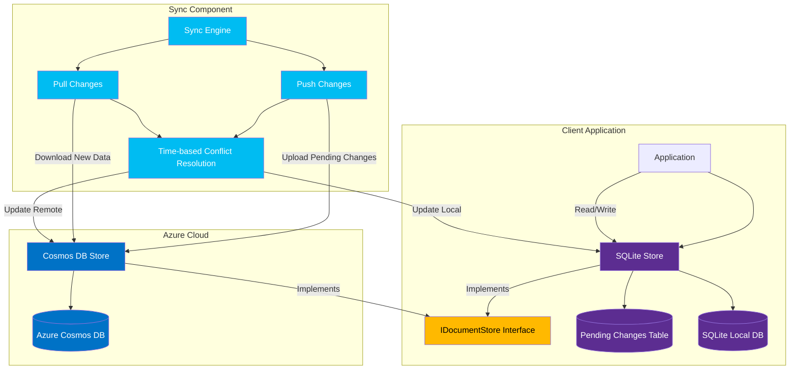
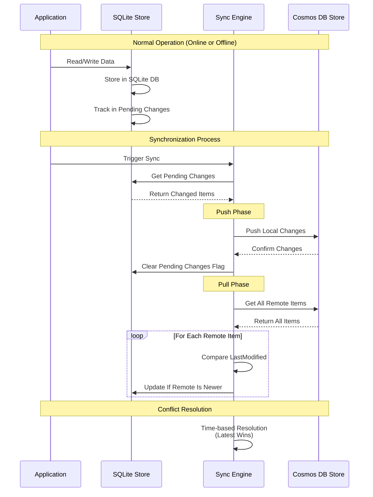

# Cosmos DB Offline Synchronization with Last-Write-Wins

This project demonstrates an offline-first synchronization solution between Azure Cosmos DB and SQLite using Last-Write-Wins conflict resolution strategy.

## Overview

The solution provides a bidirectional sync mechanism allowing applications to work offline with a local SQLite database and synchronize with Azure Cosmos DB when connectivity is available. It uses last-modified timestamps to manage conflict resolution.

### Architecture Diagram



#### Architecture Diagram Explanation

The architecture diagram illustrates the three main components of the solution:

1. **Client Application Layer**:
   - The application interacts directly with the local SQLite store
   - The SQLite store implements the `IDocumentStore` interface, providing a consistent API
   - All writes to SQLite are tracked in a separate "Pending Changes" table
   - This design allows the application to function offline with no connectivity to Azure

2. **Synchronization Component**:
   - The core of the solution that manages bidirectional data flow
   - The Push module sends local changes to Cosmos DB when online
   - The Pull module retrieves changes from Cosmos DB to local storage
   - Conflict resolution uses timestamps to determine which version "wins"
   - This component follows Azure best practices for handling transient failures and network issues

3. **Azure Cloud Layer**:
   - The remote Cosmos DB store implements the same `IDocumentStore` interface
   - This design creates a consistent abstraction between local and cloud storage
   - Leverages Cosmos DB's global distribution and high availability features
   - The consistent interface pattern makes the system extensible to other storage providers

The color-coding in the diagram differentiates between:
- Azure cloud components (blue)
- Local storage components (purple)
- Synchronization components (light blue)
- Interface definitions (yellow)

### Data Flow Diagram



#### Data Flow Diagram Explanation

The sequence diagram illustrates the temporal flow of data through the system:

1. **Normal Operation (Online or Offline)**:
   - The application always interacts with the local SQLite database
   - All write operations are automatically tracked in a "Pending Changes" table
   - This ensures seamless operation regardless of network connectivity
   - This design pattern follows the offline-first architectural principle

2. **Synchronization Process**:
   - When triggered (either manually or automatically on network detection):
     - The Sync Engine first retrieves all pending changes from the local store
     - These represent all writes that occurred while offline or since last sync

3. **Push Phase**:
   - Local changes are pushed to Cosmos DB in an optimized batch operation
   - This follows Azure best practices for minimizing API calls and transaction costs
   - After successful push, the pending changes flags are cleared locally
   - Error handling includes retry logic for transient failures

4. **Pull Phase**:
   - All remote items are retrieved from Cosmos DB
   - For each item, timestamps are compared between local and remote versions
   - The system follows an "eventual consistency" model where the latest change wins
   - This approach balances data integrity with offline functionality

5. **Conflict Resolution Strategy**:
   - Leverages the "Last-Write-Wins" pattern
   - Each document contains a LastModified timestamp field
   - When conflicts occur:
     - If local timestamp > remote timestamp: local version wins
     - If remote timestamp > local timestamp: remote version wins
   - This simple but effective strategy eliminates the need for manual conflict resolution

This synchronization approach ensures data consistency across devices while allowing the application to function seamlessly in disconnected scenarios. The eventual consistency model is particularly well-suited for mobile and occasionally-connected applications.

### Key Components

- **SyncEngine**: Core synchronization logic with Last-Write-Wins conflict resolution strategy
- **CosmosDbStore**: Repository implementation for Azure Cosmos DB
- **SqliteStore**: Repository implementation for local SQLite database
- **Unit and Integration Tests**: Comprehensive test suite

## Prerequisites

- [.NET 9.0 SDK](https://dotnet.microsoft.com/download/dotnet/9.0)
- [Azure Cosmos DB Emulator](https://learn.microsoft.com/en-us/azure/cosmos-db/local-emulator) for local development
- [Visual Studio Code](https://code.visualstudio.com/) with C# extension (optional)

## Getting Started

### Installation

1. Clone the repository
2. Navigate to the project directory
3. Restore dependencies:
   ```
   dotnet restore
   ```

### Running the Cosmos DB Emulator

Before running the application, start the Azure Cosmos DB Emulator:

```
"C:\Program Files\Azure Cosmos DB Emulator\CosmosDB.Emulator.exe" /NoUI /NoExplorer /AllowNetworkAccess
```

Alternatively, if you're using VS Code, you can use the provided task:
- Press `Ctrl+Shift+P`
- Type "Tasks: Run Task"
- Select "Start Cosmos DB Emulator"

### Running the Application

Execute from the command line:
```
cd cosmosofflinewithLCC
dotnet run
```

Or if using VS Code:
- Open the project in VS Code
- Press F5 to build and run with debugger attached

### Environment Variables

The application uses the following environment variables, which are automatically set in the VS Code launch configuration:

- `COSMOS_ENDPOINT`: The Cosmos DB endpoint (defaults to the emulator endpoint: https://localhost:8081/)
- `COSMOS_KEY`: The Cosmos DB key (defaults to the emulator key)

## Project Structure

- **cosmosofflinewithLCC/**: Main application project
  - **Data/**: Data access layer with store implementations
  - **Models/**: Domain model classes
  - **Sync/**: Synchronization engine 
- **tests/**: Testing projects
  - **cosmosofflinewithLCC.Tests/**: Unit tests
  - **cosmosofflinewithLCC.IntegrationTests/**: Integration tests

## Implementation Details

### Sync Engine

The SyncEngine implements a bidirectional synchronization strategy:

1. **Push Phase**: Pushes pending local changes to the remote Cosmos DB
2. **Pull Phase**: Pulls remote changes to the local SQLite database

Conflict resolution uses the Last-Write-Wins strategy where:
- If local timestamp > remote timestamp: local version wins
- If remote timestamp > local timestamp: remote version wins

### Data Storage

- **SqliteStore**: Uses SQLite for local offline storage
- **CosmosDbStore**: Communicates with Azure Cosmos DB

### Models

Models must implement:
- A unique ID property
- A LastModified timestamp property for conflict resolution

## Testing

Run the unit tests:
```
dotnet test tests/cosmosofflinewithLCC.Tests
```

Run the integration tests (requires the Cosmos DB Emulator to be running):
```
dotnet test tests/cosmosofflinewithLCC.IntegrationTests
```

## Limitations

- Soft deletes not yet implemented (see TODO in SyncEngine)
- Partial document updates not supported

## License

[MIT License](LICENSE)