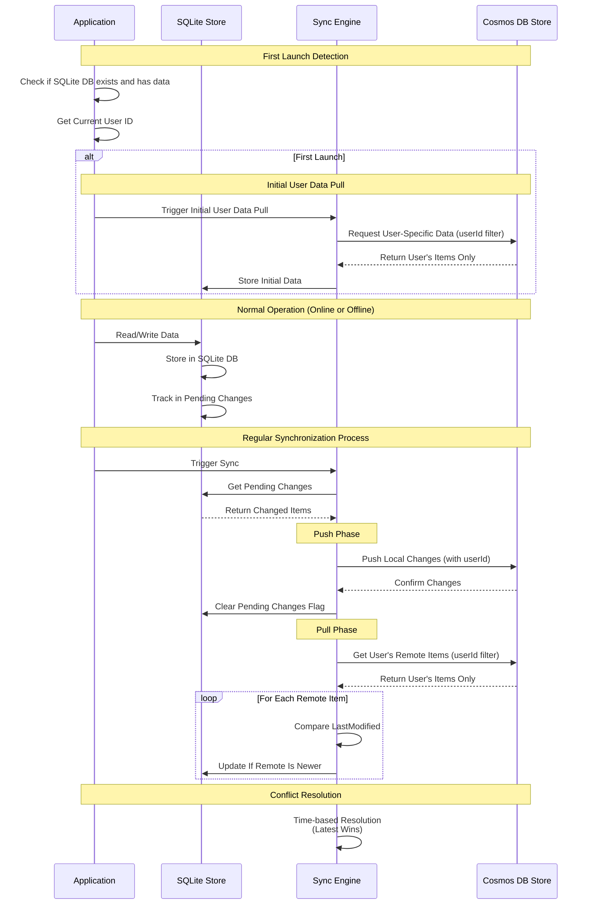

# Cosmos DB Offline Synchronization with Last-Write-Wins

This project demonstrates an offline-first synchronization solution between Azure Cosmos DB and SQLite using Last-Write-Wins conflict resolution strategy.

## Overview

The solution provides a bidirectional sync mechanism allowing applications to work offline with a local SQLite database and synchronize with Azure Cosmos DB when connectiv3. **Batch Preparation**:
   - Document IDs are collected in a batch for efficient retrieval
   - The system ensures all documents have proper:
     - User ID properties
     - Type properties
     - Timestamp information available. It uses last-modified timestamps to manage conflict resolution.

### Architecture Diagram


#### Architecture Diagram Explanation

The architecture diagram illustrates the three main components of the solution:

1. **Client Application Layer**:
   - The application interacts directly with the local SQLite store
   - The SQLite store implements the `IDocumentStore` interface, providing a consistent API
   - All writes to SQLite are tracked in a separate "Pending Changes" table
   - This design allows the application to function offline with no connectivity to Azure

2. **Synchronization Component**:
   - The core of the solution that manages bidirectional data flow
   - The Push module sends local changes to Cosmos DB when online
   - The Pull module retrieves changes from Cosmos DB to local storage
   - Conflict resolution uses timestamps to determine which version "wins"
   - This component follows Azure best practices for handling transient failures and network issues

3. **Azure Cloud Layer**:
   - The remote Cosmos DB store implements the same `IDocumentStore` interface
   - This design creates a consistent abstraction between local and cloud storage
   - Leverages Cosmos DB's global distribution and high availability features
   - The consistent interface pattern makes the system extensible to other storage providers

The color-coding in the diagram differentiates between:
- Azure cloud components (blue)
- Local storage components (purple)
- Synchronization components (light blue)
- Interface definitions (yellow)

### Data Flow Diagram



#### Data Flow Diagram Explanation

The sequence diagram illustrates the temporal flow of data through the system:

1. **Normal Operation (Online or Offline)**:
   - The application always interacts with the local SQLite database
   - All write operations are automatically tracked in a "Pending Changes" table
   - This ensures seamless operation regardless of network connectivity
   - This design pattern follows the offline-first architectural principle

2. **Synchronization Process**:
   - When triggered (either manually or automatically on network detection):
     - The Sync Engine first retrieves all pending changes from the local store
     - These represent all writes that occurred while offline or since last sync

3. **Push Phase**:
   - Local changes are pushed to Cosmos DB in an optimized batch operation
   - This follows Azure best practices for minimizing API calls and transaction costs
   - After successful push, the pending changes flags are cleared locally
   - Error handling includes retry logic for transient failures

4. **Pull Phase**:
   - All remote items are retrieved from Cosmos DB
   - For each item, timestamps are compared between local and remote versions
   - The system follows an "eventual consistency" model where the latest change wins
   - This approach balances data integrity with offline functionality

5. **Conflict Resolution Strategy**:
   - Leverages the "Last-Write-Wins" pattern
   - Each document contains a LastModified timestamp field
   - When conflicts occur:
     - If local timestamp > remote timestamp: local version wins
     - If remote timestamp > local timestamp: remote version wins
   - This simple but effective strategy eliminates the need for manual conflict resolution

This synchronization approach ensures data consistency across devices while allowing the application to function seamlessly in disconnected scenarios. The eventual consistency model is particularly well-suited for mobile and occasionally-connected applications.

### Key Components

- **SyncEngine**: Core synchronization logic with Last-Write-Wins conflict resolution strategy
- **CosmosDbStore**: Repository implementation for Azure Cosmos DB
- **SqliteStore**: Repository implementation for local SQLite database
- **Unit and Integration Tests**: Comprehensive test suite

## Prerequisites

- [.NET 9.0 SDK](https://dotnet.microsoft.com/download/dotnet/9.0)
- [Azure Cosmos DB Emulator](https://learn.microsoft.com/en-us/azure/cosmos-db/local-emulator) for local development
- [Visual Studio Code](https://code.visualstudio.com/) with C# extension (optional)

## Getting Started

### Installation

1. Clone the repository
2. Navigate to the project directory
3. Restore dependencies:
   ```
   dotnet restore
   ```

### Running the Cosmos DB Emulator

Before running the application, start the Azure Cosmos DB Emulator:

```
"C:\Program Files\Azure Cosmos DB Emulator\CosmosDB.Emulator.exe" /NoUI /NoExplorer /AllowNetworkAccess
```

Alternatively, if you're using VS Code, you can use the provided task:
- Press `Ctrl+Shift+P`
- Type "Tasks: Run Task"
- Select "Start Cosmos DB Emulator"

### Running the Application

Execute from the command line:
```
cd cosmosofflinewithLCC
dotnet run
```

Or if using VS Code:
- Open the project in VS Code
- Press F5 to build and run with debugger attached

### Environment Variables

The application uses the following environment variables, which are automatically set in the VS Code launch configuration:

- `COSMOS_ENDPOINT`: The Cosmos DB endpoint (defaults to the emulator endpoint: https://localhost:8081/)
- `COSMOS_KEY`: The Cosmos DB key (defaults to the emulator key)
- `CURRENT_USER_ID`: The user ID for data filtering (defaults to "user1")

## Project Structure

- **cosmosofflinewithLCC/**: Main application project
  - **Data/**: Data access layer with store implementations
  - **Models/**: Domain model classes
  - **Sync/**: Synchronization engine 
- **tests/**: Testing projects
  - **cosmosofflinewithLCC.Tests/**: Unit tests
  - **cosmosofflinewithLCC.IntegrationTests/**: Integration tests

## Implementation Details

### Sync Engine

The SyncEngine implements a bidirectional synchronization strategy:

1. **Push Phase**: Pushes pending local changes to the remote Cosmos DB
2. **Pull Phase**: Pulls remote changes to the local SQLite database

Conflict resolution uses the Last-Write-Wins strategy where:
- If local timestamp > remote timestamp: local version wins
- If remote timestamp > local timestamp: remote version wins

### Data Storage

- **SqliteStore**: Uses SQLite for local offline storage with user-specific data filtering capabilities
- **CosmosDbStore**: Communicates with Azure Cosmos DB

### Models

Models must implement:
- A unique ID property
- A LastModified timestamp property for conflict resolution
- A UserId property for user-specific data filtering

### User-Specific Data Handling

The solution now includes enhanced support for user-specific data operations:

1. **User-Specific Data Retrieval**:
   - The `IDocumentStore` interface now includes a `GetByUserIdAsync(string userId)` method
   - This allows efficient filtering of data by user ID directly at the store level
   - Implemented in both SQLite and Cosmos DB stores for consistent behavior

2. **User-Specific Pending Changes**:
   - Added capability to retrieve only pending changes for a specific user
   - The SQLite store implements `GetPendingChangesForUserAsync(string userId)`
   - This optimization is valuable for multi-user scenarios where only a specific user's changes need synchronization

3. **SQLite Schema Improvements**:
   - The SQLite store now includes a `UserId` column in its schema
   - It detects and automatically adds this column for backward compatibility
   - Uses JSON extraction to efficiently query user-specific data
   - Optimized queries for both user-filtered and pending changes operations

4. **User Data Privacy**:
   - Enhanced security boundaries between user data
   - Each user's data is properly isolated and filtered during sync operations
   - Prevents data leakage between users in multi-tenant scenarios

These enhancements improve the solution's scalability, performance, and security for multi-user applications.

## Testing

Run the unit tests:
```
dotnet test tests/cosmosofflinewithLCC.Tests
```

Run the integration tests (requires the Cosmos DB Emulator to be running):
```
dotnet test tests/cosmosofflinewithLCC.IntegrationTests
```

## Limitations

- Soft deletes not yet implemented (see TODO in SyncEngine)
- Partial document updates not supported

## License

[MIT License](LICENSE)

## Initial Data Load and User-Specific Data

The application supports user-specific data and implements an intelligent initial data load mechanism:

### User-Specific Data

- Each document in the system includes a `UserId` property that associates data with specific users
- This enables multi-user scenarios where each user only accesses their own data
- The current user ID is determined at application startup (in a real application, this would come from authentication)
- User ID can be configured via the `CURRENT_USER_ID` environment variable (defaults to "user1")

### Initial Data Load

The application implements a smart initial load strategy:

1. **First Launch Detection**:
   - The application automatically detects first launch by checking if the SQLite database exists and has data
   - This eliminates the need for user intervention or configuration during first-time setup

2. **User-Specific Initial Pull**:
   - On first launch, the application performs an initial pull of user-specific data from Cosmos DB
   - Only documents associated with the current user's ID are downloaded to the local SQLite database
   - This ensures:
     - Data privacy by only retrieving relevant user data
     - Optimized performance by limiting the initial data transfer
     - Reduced storage requirements on the client device

3. **Efficient Synchronization**:
   - After the initial data load, subsequent synchronizations only transfer changes
   - This minimizes data transfer and improves performance for users with large datasets

This approach is particularly beneficial for:
- Mobile applications with limited network bandwidth
- Multi-tenant systems where users should only access their own data
- Applications that need to optimize initial startup time

## Synchronization Process in Detail

This section provides an in-depth explanation of how the synchronization process works, which is valuable for new developers joining the project.

### Local Database Structure

To understand the sync process, it's important to know how the local database is structured:

1. **Main Data Tables**:
   - For each model type (e.g., `Items`, `Orders`, `AssessmentPlans`), a corresponding SQLite table is created
   - These tables store the actual document data in a serialized JSON format
   - Each record includes metadata like timestamps and user IDs

2. **Pending Changes Tracking**:
   - Each model type has a corresponding `PendingChanges_{ModelName}` table
   - These tables track the IDs of items that have been modified locally but not yet synced to Cosmos DB
   - No actual document data is stored in these tables—only references

3. **Schema Design**:
   - Each main data table contains:
     - `ID`: Unique identifier for the document
     - `Content`: JSON-serialized document
     - `LastModified`: Timestamp used for conflict resolution
     - `OIID`: User ID for data partitioning

### Before Synchronization

Before the sync process begins:

1. **Local Changes Tracking**:
   - When a user creates, updates, or modifies data locally:
     - The document is stored/updated in the main table (e.g., `Items`)
     - An entry is added to the `PendingChanges_{ModelName}` table
     - The `LastModified` timestamp is updated to the current time

2. **Data Access Pattern**:
   - All application operations work against the local database
   - This enables offline functionality even when no connection to Azure is available
   - Users can continue working without interruption

3. **State Management**:
   - Documents maintain their state with:
     - Updated timestamps indicating when changes occurred
     - User ID properties to maintain data partitioning
     - Document type metadata for proper categorization

### During Synchronization

The sync process executes in two distinct phases:

#### Phase 1: Push Phase (Local to Remote)

1. **Pending Changes Collection**:
   - The system queries the local SQLite database for all items in the `PendingChanges_{ModelName}` tables
   - It loads the corresponding full documents from the main data tables
   - This creates a complete set of local changes that need to be pushed to the cloud

2. **Batch Preparation**:
   - Document IDs are collected in a batch for efficient retrieval 
   - The system ensures all documents have proper:
     - User ID properties
     - Type properties
     - Timestamp information

3. **Remote Validation**:
   - For optimization, all relevant remote items are retrieved in a single batch operation
   - For each pending local change, the system compares it with its remote version:
     - If local timestamp > remote timestamp: The local version is pushed
     - If remote timestamp > local timestamp: The local change is skipped (remote wins)
     - If the item doesn't exist remotely: It's always pushed

4. **Bulk Updates**:
   - Documents requiring updates are sent to Cosmos DB in a bulk operation
   - This minimizes the number of network requests and reduces RU consumption
   - Each document is sent with proper partition key information

5. **Pending Status Clearing**:
   - After a successful push, the corresponding IDs are removed from the `PendingChanges_{ModelName}` tables
   - This happens regardless of whether the item was actually pushed or skipped due to conflict resolution

#### Phase 2: Pull Phase (Remote to Local)

1. **Remote Data Retrieval**:
   - The system retrieves all documents for the current user from Cosmos DB
   - This uses a partition key query for efficiency, filtering by the user's ID

2. **Local Comparison**:
   - For each remote document, the system performs a point lookup in the local database
   - It then compares timestamps to determine which version is newer

3. **Timestamp-Based Updates**:
   - If remote timestamp > local timestamp: The local copy is updated with the remote version
   - If local timestamp > remote timestamp: The local copy is kept unchanged
   - If the item doesn't exist locally: It's always added from the remote source

4. **Non-Tracked Updates**:
   - Critically, updates from the remote store are NOT marked as pending changes
   - This prevents cyclical sync issues where data would constantly ping-pong between stores
   - The `UpsertBulkAsync` method is called with `trackAsyncChanges` set to `false`

### After Synchronization

Once synchronization completes:

1. **Database State**:
   - The local SQLite database contains the most up-to-date information based on the Last-Write-Wins strategy
   - Data is consistent between the local store and the remote Cosmos DB (eventual consistency)

2. **Pending Changes State**:
   - The `PendingChanges_{ModelName}` tables are cleared of successfully synced items
   - Any new changes made during the sync process will still be present and marked for the next sync

3. **Performance Metrics**:
   - The system logs detailed information about the sync operation:
     - Number of items pushed to remote (successes)
     - Number of items pulled from remote (updates)
     - Number of items skipped due to conflicts
     - Total synchronization duration

4. **Continued Operation**:
   - The application continues to track changes for the next synchronization cycle
   - Each write operation to the local database will again be tracked in the pending changes tables
   - This creates a continuous synchronization loop that maintains eventual consistency

### Special Case: Initial Data Pull

For first-time app launches, a special synchronization flow occurs:

1. **Detection**:
   - The application checks if the SQLite database exists and has data
   - If not, it's determined to be a first launch

2. **Initial Pull**:
   - Only remote data belonging to the current user is pulled down
   - No local data is pushed up (since there isn't any yet)
   - All data is marked as non-pending to avoid unnecessary sync operations

3. **Database Initialization**:
   - This initializes the local database with a starting dataset
   - Operations are optimized by only transferring relevant user data

### Error Handling and Recovery

The sync process includes comprehensive error handling:

1. **Transaction Safety**:
   - SQLite operations use transactions to maintain database consistency
   - If errors occur during sync, changes are rolled back to prevent data corruption

2. **Detailed Logging**:
   - The system records detailed information about the sync process
   - This aids in troubleshooting when issues arise

3. **Retry Logic**:
   - The system is designed to handle transient failures in connectivity
   - This is particularly important for mobile applications or unreliable network conditions

### User Context Changes

When a user context changes (e.g., different user logs in):

1. **Context Update**:
   - The sync engine's user context is updated via the `UpdateUserId` method
   - All subsequent operations use the new user ID for filtering

2. **Data Isolation**:
   - The sync process automatically filters data using the new user ID
   - This maintains proper data boundaries between different users

### Item Creation Sync Differences

The system handles user-created vs. engine-created items differently:

#### User-Created vs. Engine-Created Items

| Aspect | User-Created Items | Engine-Created Items |
|--------|-------------------|---------------------|
| **Origin** | Created in local app | Created on other devices or directly in Cosmos DB |
| **Pending Changes** | Marked as pending | NOT marked as pending |
| **Push Behavior** | Pushed to Cosmos DB | Never pushed back (prevents loops) |
| **Timestamp** | New timestamp created locally | Original timestamp preserved |
| **Sync Result** | Appear as remote changes on other devices | Integrated locally with original metadata |

This critical distinction prevents:

- **Sync Loops**: Items bouncing endlessly between local and remote stores
- **Duplicate Data**: Multiple copies of the same item across stores
- **Data Corruption**: Inconsistent timestamps causing data loss

When a user creates an item, the system records it for sync. When the engine pulls an item from Cosmos DB, it integrates it without marking it for re-upload, maintaining data integrity across the sync ecosystem.

### Example Usage

The typical usage pattern for the synchronization process is:

1. **Instance Creation**: Create a `SyncEngine` instance with proper stores and user context
2. **Initial Population**: If it's the first run, perform `InitialUserDataPullAsync`
3. **Regular Syncs**: Call `SyncAsync()` periodically to keep data in sync
4. **Change Tracking**: All local changes are automatically tracked

This usage pattern allows applications to maintain a consistent data state while functioning smoothly in both connected and disconnected scenarios.
